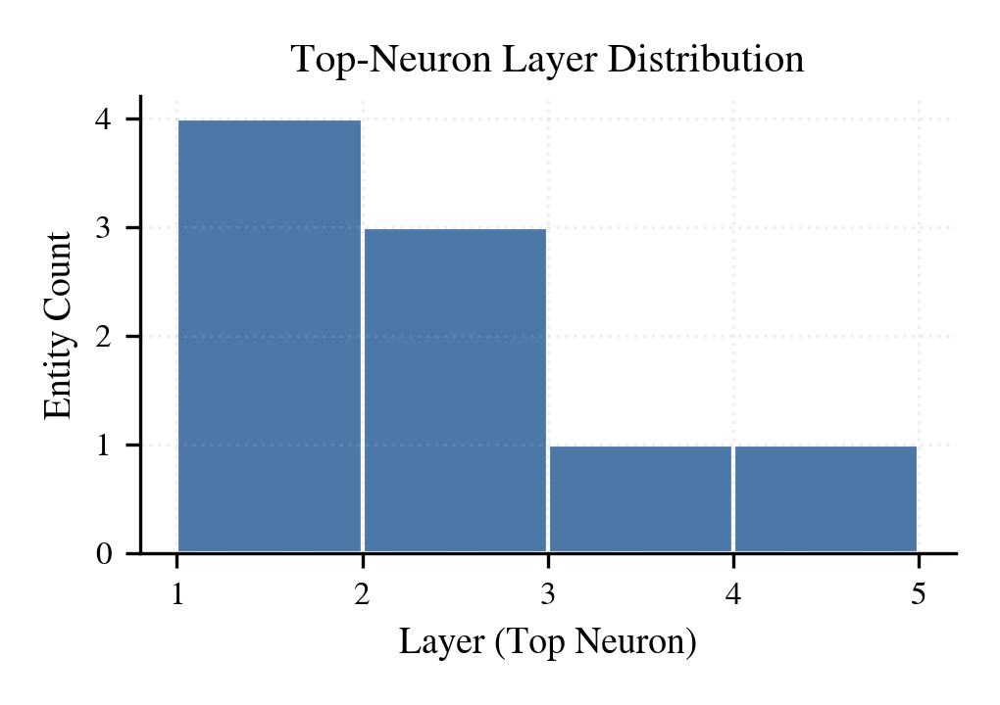
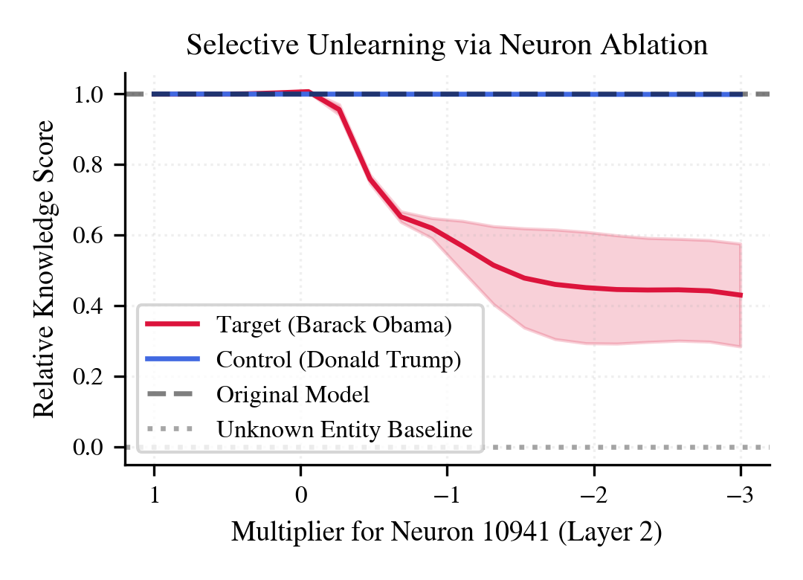
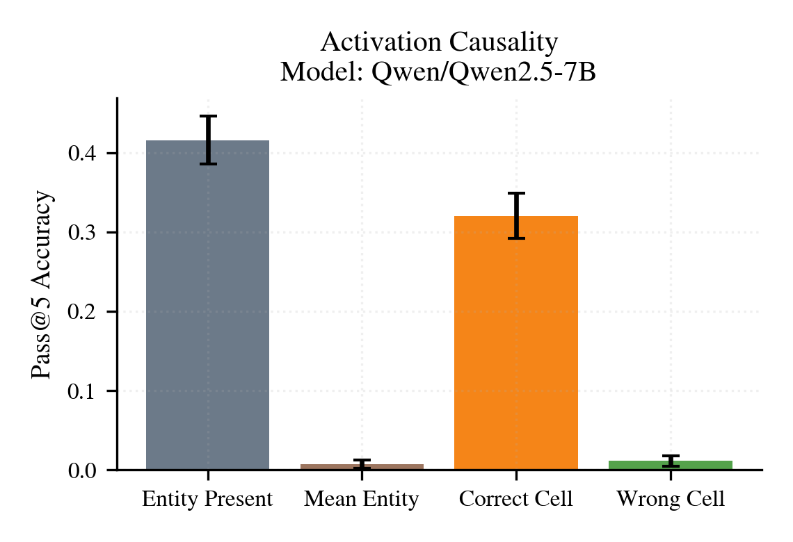
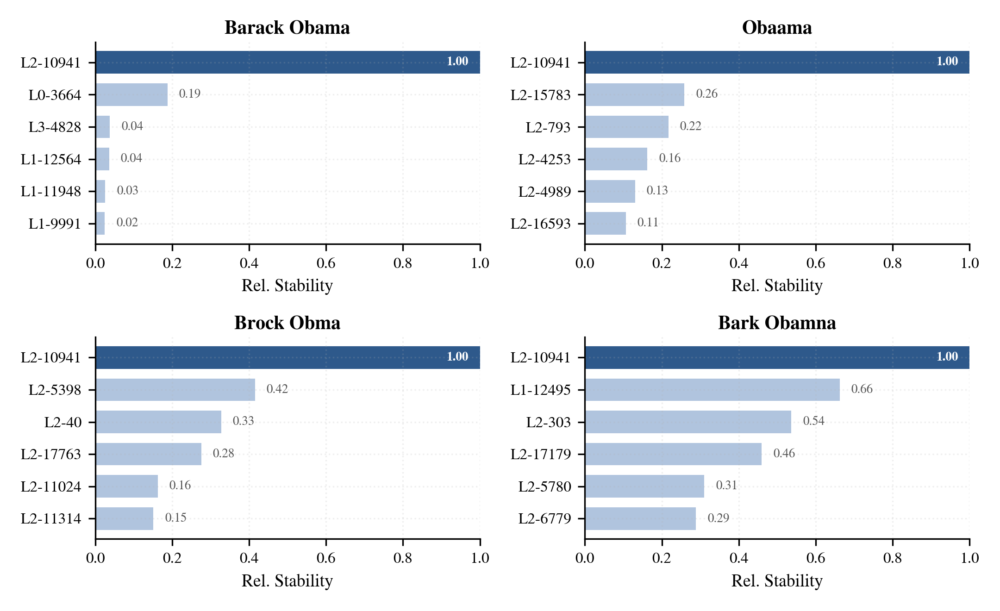
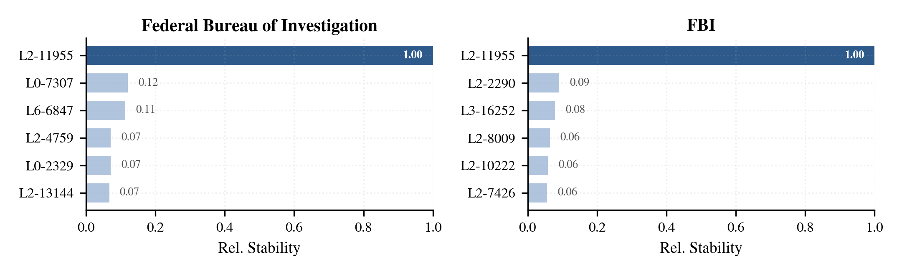
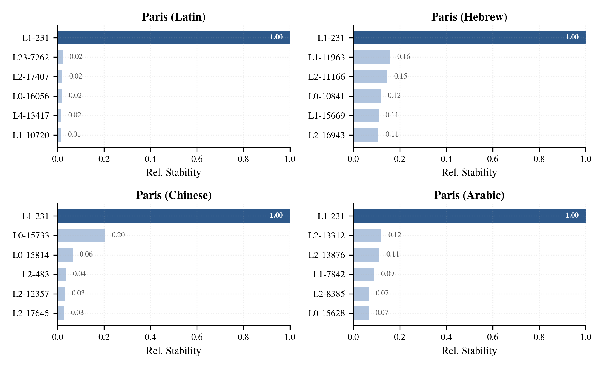
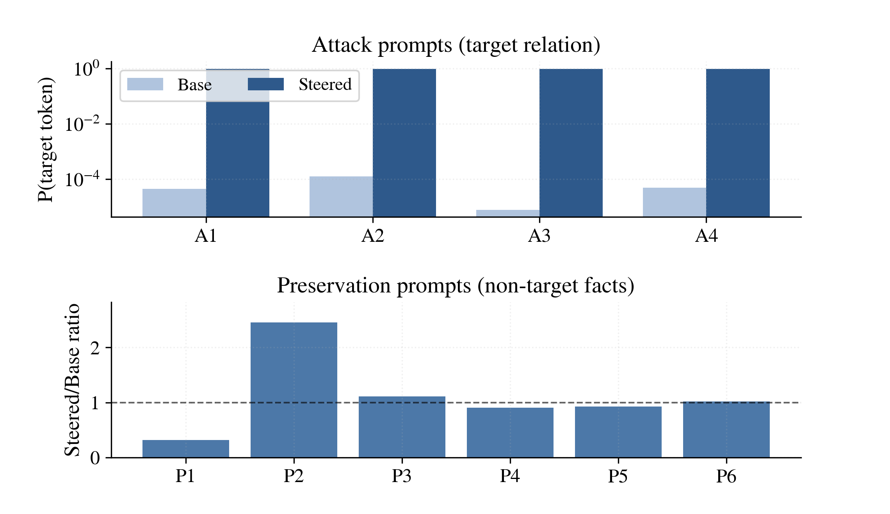

# Friends and Grandmothers in Silico

Code, figures, and experiment artifacts for the paper on localizing entity cells in language models.

## Overview
This repository studies sparse, entity-selective MLP neurons ("entity cells") and tests whether they provide causal access points for factual recall.

The current snapshot contains:
- paper figures used in the manuscript
- scripts for localization, ablation, injection, and cross-model replication
- entity lists and prompt assets used by the experiments
- cached experiment outputs and model-suite summaries

## Repository Layout
- `scripts/`: core experiment and plotting entry points
- `data/`: entity inventories, anchor metadata, and small local replication assets
- `figures/`: manuscript-ready figures and supporting plots
- `results/`: experiment outputs, summaries, and model-suite artifacts
- `paper/`: manuscript sources and bibliography assets

## Main Scripts
- `scripts/f1_f3_localization.py`: localization and variant robustness runs
- `scripts/f2_neuron_localization.py`: PopQA entity-cell localization
- `scripts/f4_activation_causality.py`: controlled injection / causal evaluation
- `scripts/f6_popqa_unlearning_validation.py`: negative-ablation validation
- `scripts/run_model_paper_suite.py`: end-to-end per-model paper suite
- `scripts/run_cross_model_replication.py`: cross-model replication batch runner

## Data Files
- `data/entities_popqa_popular_200.txt`: 200-entity PopQA inventory
- `data/popqa-200.txt`: PopQA subset with question-count filtering used by active evaluation scripts
- `data/entities-default.txt`: small default entity set for localization / sanity-check runs
- `data/known-anchor-neurons.json`: fixed anchor neurons for reference experiments

## Qwen2.5 Main Figures
The repository includes the main Qwen2.5-7B figures from the paper. The teaser is shown at the top; the next seven main figures are previewed below.

### Figure 2. Localization depth

### Figure 3. Entity-specific amnesia

### Figure 4. Controlled injection

### Figure 5. Variant robustness

### Figure 6. Acronym robustness

### Figure 7. Multilingual robustness

### Figure 8. Latent steering

## Reproducing Runs
Most paper-facing workflows are driven from the `scripts/` directory. Typical entry points are:
- `python scripts/run_model_paper_suite.py --model Qwen/Qwen2.5-7B`
- `python scripts/run_cross_model_replication.py`
- `python scripts/build_model_suite_report.py`

Some runs require large models, GPU memory, and local credentials / caches, so exact reproduction depends on your environment.

## Citation
If you use this repository, please cite the associated paper once the final bibliographic entry is available.
