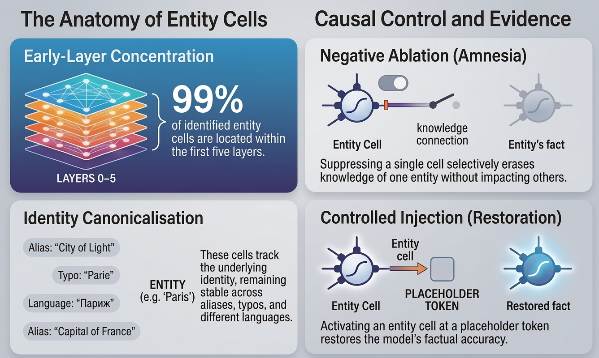

# Friends and Grandmothers in Silico

Code, figures, and experiment artifacts for the paper on localizing entity cells in language models.

## Overview
This repository studies sparse, entity-selective MLP neurons ("entity cells") and tests whether they provide causal access points for factual recall.

The current snapshot contains:
- paper figures used in the manuscript
- scripts for localization, ablation, injection, and cross-model replication
- entity lists and prompt assets used by the experiments
- cached experiment outputs and model-suite summaries

## Repository Layout
- `scripts/`: core experiment and plotting entry points
- `configs/`: active run configs and anchor metadata
- `data/`: entity inventories and small local data assets
- `figures/`: manuscript-ready figures and supporting plots
- `results/`: experiment outputs, summaries, and model-suite artifacts
- `paper/`: manuscript sources and bibliography assets

## Main Scripts
- `scripts/f1_f3_localization.py`: localization and variant robustness runs
- `scripts/f2_neuron_localization.py`: PopQA entity-cell localization
- `scripts/f4_activation_causality.py`: controlled injection / causal evaluation
- `scripts/f6_popqa_unlearning_validation.py`: negative-ablation validation
- `scripts/run_model_paper_suite.py`: end-to-end per-model paper suite
- `scripts/run_cross_model_replication.py`: cross-model replication batch runner

## Data Files
- `data/entities_popqa_popular_200.txt`: 200-entity PopQA inventory
- `configs/entities_popqa_popular_200_minq2.txt`: PopQA subset with question-count filtering used by active evaluation scripts
- `configs/entities_default.txt`: small default entity set for localization / sanity-check runs
- `configs/known_anchor_neurons.json`: fixed anchor neurons for reference experiments

## Paper Figures
### Main text
- Figure 1 teaser: [figures/fig01_teaser_entity_neurons.png](figures/fig01_teaser_entity_neurons.png)
- Figure 2 localization depth: [figures/fig02_qwen25_base_localization_depth.pdf](figures/fig02_qwen25_base_localization_depth.pdf)
- Figure 3 amnesia: [figures/fig03_qwen25_base_amnesia_obama_trump.pdf](figures/fig03_qwen25_base_amnesia_obama_trump.pdf)
- Figure 4 controlled injection: [figures/fig04_qwen25_base_entity_injection.pdf](figures/fig04_qwen25_base_entity_injection.pdf)
- Figure 5 variant robustness: [figures/fig05_qwen25_base_variant_robustness.pdf](figures/fig05_qwen25_base_variant_robustness.pdf)
- Figure 6 acronym robustness: [figures/fig06_qwen25_base_acronym_robustness.pdf](figures/fig06_qwen25_base_acronym_robustness.pdf)
- Figure 7 multilingual robustness: [figures/fig07_qwen25_base_multilingual_robustness.pdf](figures/fig07_qwen25_base_multilingual_robustness.pdf)
- Figure 8 latent steering: [figures/fig08_qwen25_base_latent_steering_edit_vs_preserve.pdf](figures/fig08_qwen25_base_latent_steering_edit_vs_preserve.pdf)

### Appendix / extensions
- Qwen2.5-Instruct figures: [figures/fig09_qwen25_instruct_localization_depth.pdf](figures/fig09_qwen25_instruct_localization_depth.pdf), [figures/fig10_qwen25_instruct_amnesia.pdf](figures/fig10_qwen25_instruct_amnesia.pdf), [figures/fig11_qwen25_instruct_entity_injection.pdf](figures/fig11_qwen25_instruct_entity_injection.pdf), [figures/fig12_qwen25_instruct_variant_robustness.pdf](figures/fig12_qwen25_instruct_variant_robustness.pdf), [figures/fig13_qwen25_instruct_acronym_robustness.pdf](figures/fig13_qwen25_instruct_acronym_robustness.pdf), [figures/fig14_qwen25_instruct_multilingual_robustness.pdf](figures/fig14_qwen25_instruct_multilingual_robustness.pdf)
- Qwen3 figures: [figures/fig15_qwen3_localization_depth.pdf](figures/fig15_qwen3_localization_depth.pdf), [figures/fig16_qwen3_amnesia.pdf](figures/fig16_qwen3_amnesia.pdf), [figures/fig17_qwen3_entity_injection.pdf](figures/fig17_qwen3_entity_injection.pdf), [figures/fig18_qwen3_variant_robustness.pdf](figures/fig18_qwen3_variant_robustness.pdf), [figures/fig19_qwen3_acronym_robustness.pdf](figures/fig19_qwen3_acronym_robustness.pdf), [figures/fig20_qwen3_multilingual_robustness.pdf](figures/fig20_qwen3_multilingual_robustness.pdf)
- Cross-family summaries: [figures/fig21_cross_family_localization_depth_grid.pdf](figures/fig21_cross_family_localization_depth_grid.pdf), [figures/fig22_cross_family_entity_injection_summary.pdf](figures/fig22_cross_family_entity_injection_summary.pdf), [figures/fig23_olmo_entity_injection.pdf](figures/fig23_olmo_entity_injection.pdf), [figures/fig24_olmo_amnesia.pdf](figures/fig24_olmo_amnesia.pdf)

## Reproducing Runs
Most paper-facing workflows are driven from the `scripts/` directory. Typical entry points are:
- `python scripts/run_model_paper_suite.py --model Qwen/Qwen2.5-7B`
- `python scripts/run_cross_model_replication.py`
- `python scripts/build_model_suite_report.py`

Some runs require large models, GPU memory, and local credentials / caches, so exact reproduction depends on your environment.

## Citation
If you use this repository, please cite the associated paper once the final bibliographic entry is available.
